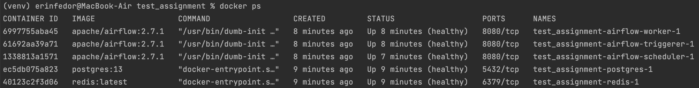

Test Assignment
==============================

End-to-end ML pipeline for RTB task. Fedor Erin, Oct 2023.

How to run a pipeline
------------

1. Clone project directory and run the following commands in it:
   1. Initialize Airflow: `docker compose up airflow-init`
   2. Build Docker image: `docker build -f dags/docker_job/Dockerfile -t docker_job_image .`
   3. Start Airflow components: `docker compose up`
      * make sure all containers are up and running:
4. Visit `http://localhost:8080/` and log in using `user=airflow` and `password=airflow`
5. Run DAG with all pipeline steps, check out tasks (containers) logs, if needed
6. After completion, the new files are created:
   * `data/predictions/predictions_*.npy` - probability predictions for test data
   * `models/pipeline_*.pkl` - trained model/pipeline
   * `reports/report_*.yaml` - cross-validation metrics and model parameters

Project Structure
------------

    ├── dags                  <- Airflow DAGs
    │   ├── docker_job        <- Pipeline Dockefile and DAG file
    │   |   └── Dockerfile 
    │   |   └── docker-job.py
    ├── data
    │   ├── predictions       <- Saved model predictions as NumPy arrays
    │   ├── processed         <- The final, canonical data sets for modeling
    │   └── raw               <- The original, immutable data dump
    │
    ├── models                <- Trained and serialized models (sklearn pipelines)
    │
    ├── notebooks             <- Jupyter notebooks with exploration
    │   ├── eda.ipynb         <- Exploratory Data Analysis
    │   ├── modelling.ipynb   <- Sandbox for testing pipeline and analysing predictions
    │
    ├── reports               <- Models parameters and validation metrics for pipeline runs
    │
    ├── src                   <- Source code for use in this project
    │   ├── __init__.py       <- Makes src a Python module
    │   ├── config.py         <- Config file with namings/parameters
    │   │
    │   ├── data              <- Scripts to generate datasets
    │   │   └── make_dataset.py
    │   │   └── preprocessing.py
    │   │
    │   ├── models            <- Scripts to train models and make predictions
    │   │   ├── make_predicting.py
    │   │   ├── make_training.py
    │   │   ├── pipeline.py
    │   │   └── utils.py
    │   │
    ├── LICENSE
    ├── .gitignore    
    ├── README.md
    ├── .flake8
    ├── requirements.txt
    └── docker-compose.yaml   <- Airflow services for a pipeline

--------

<small>Project based on the <a target="_blank" href="https://drivendata.github.io/cookiecutter-data-science/">cookiecutter data science project template</a>. #cookiecutterdatascience</small>

