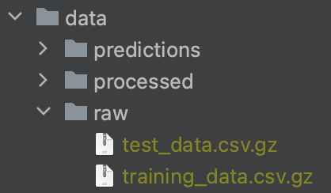
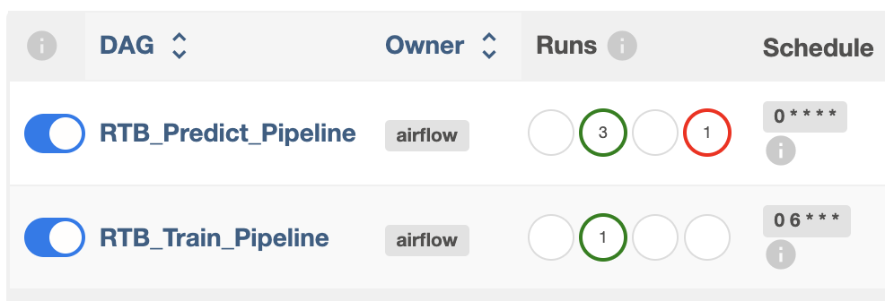
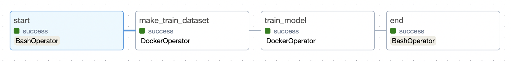
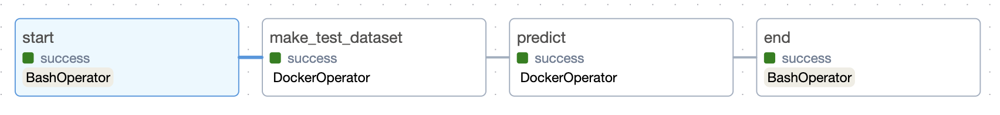

# Test Assignment

* End-to-end ML pipeline for RTB task
* README contains 3 parts: 
  * Setup
  * Project structure
  * Solution description and considerations

## Setup
0) Ensure the environment:
   - Create `venv` with IDE
   - Install the dependencies with `pip install -r requirements_venv.txt`
   - Make sure that Docker daemon is up and running, e.g. check with `docker ps` 

1) Put the raw data `training_data.csv.gz` and `test_data.csv.gz` into `data/raw` project local folder:

<p align="center"></p>

2) Run the master script to consequently initialize Airflow, build Docker image and start all components as containers:

```bash
sh run.sh
```

3) Visit `http://localhost:8080/` and log in using the credentials: `user=airflow` and `password=airflow`. 
There are two DAGs, for train and predict:

<p align="center"></p>

4) Run the training DAG first:

<p align="center"></p>

- As a result, it creates in the project the following files:
  - `data/processed/train_df.csv` - processed dataset for train
  - `models/pipeline_*.pkl` - trained model/pipeline
  - `reports/report_*.yaml` - cross-validation metrics and model parameters
   

5) Next, run the predicting DAG:

<p align="center"></p>

- As a result, it creates the following files:
  - `data/processed/test_df.csv` - processed dataset for test
  - `data/predictions/predictions_*.npy` - probability predictions for test data

6) Check out the tasks (containers) logs, if needed, as well as intermediate and resulting files.

## Project Structure

    ├── airflow               <- Airflow folder
    │   ├──dags               <- DAGs folder
    │   |   ├── pipeline      <- Job Dockerfile and pipelines DAG files
    │   |   |   └── Dockerfile 
    │   |   |   └── predict_pipeline.py
    │   |   |   └── train_pipeline.py
    │   ├──config            
    │   ├──logs               <- Airflow auxiliary directories
    │   └──plugins   
    │
    ├── data
    │   ├── predictions       <- Saved model predictions as NumPy arrays
    │   ├── processed         <- The final, canonical data sets for modeling
    │   └── raw               <- The original, immutable data dump
    │
    ├── imgs                  <- Images for README
    │    
    ├── models                <- Trained and serialized models (sklearn pipelines)
    │
    ├── notebooks             <- Jupyter notebooks with exploration
    │   └── eda.ipynb         <- Exploratory Data Analysis│
    │
    ├── reports               <- YAML reports with models parameters and validation metrics
    │
    ├── src                   <- Source code for use in this project
    │   ├── __init__.py       <- Makes src a Python module
    │   ├── config.py         <- Config file with namings/parameters
    │   │
    │   ├── data              <- Scripts to generate datasets
    │   │   └── make_dataset.py
    │   │   └── preprocessing.py
    │   │
    │   ├── models            <- Scripts to train models and make predictions
    │   │   ├── make_predicting.py
    │   │   ├── make_training.py
    │   │   ├── pipeline.py
    │   │   └── utils.py
    │   │
    ├── LICENSE
    ├── .env                  <- Environment variables
    ├── .gitignore
    ├── README.md
    ├── run.sh                <- Master script to run the project
    ├── .flake8               <- Style checker config
    ├── requirements.txt      <- Packages required for Docker tasks
    ├── requirements_venv.txt <- pip freeze of project's venv for full reproducibility
    └── docker-compose.yaml   <- Airflow services for pipeline

## Solution description and considerations

1) Description of the pipeline and design choices:
   1) The train and predict pipelines are separated. The train pipeline is intended for periodic offline training, while
the predict pipeline is designed to run as frequently as needed and utilizes the trained model.
   2) The solution incorporates containerization to keep Airflow and its components running in containers as services. 
Each of the DAG's tasks is executed with DockerOperator, enabling independent and customizable environments for various 
types of tasks.
   3) As a predictive model it's used a LogReg classifier for simplicity which sets a baseline of prediction metrics 
and can be further improved. It's recommended to use a DL model with Embeddings layers to handle high cardinality of 
categorical features, e.g. `nn.Embedding` represents each category as embedding vector, then all the tensors are 
concatenated alongside with numerical features and passed forward to dense layers.
2) Additional considerations for deploying such a solution at scale:
   1) __Fast real-time inference__: the model must efficiently process input data, make predictions, and store results 
in a key-value store, such as Aerospike, for subsequent use by the other backend services.
   2) __Model as a service__: the model can be encapsulated as an API, such as FastAPI, to deliver optimal performance 
and serve as a service for other processes and pipelines. Real-time event stream processing, such as Apache Kafka, 
is useful for handling vast of messages.
3) Extra considerations:
   1) deployment strategies and approaches:
      - __Deployment__: it's good to use serverless functions, e.g. AWS Lambda, GCP Functions, or Azure Functions 
   for on-demand scaling.
      - __Containerization__: it's applicable to use Docker and Kubernetes for containerized deployments.
      - __API gateway__: there's a way to use an API gateway like AWS API Gateway or GCP Endpoints to expose the model as 
   a RESTful API.
      - __Scalability__: it's critical to ensure that deployment is scalable to handle varying levels of traffic and requests.
   2) potential challenges and nuances:
      - __Low Latency__: achieving low latency in RTB is crucial, the infrastructure and model should respond within 
milliseconds.
      - __Model Drift__: continuously monitor and retrain the model to account for concept drift in user behavior and 
market conditions.
      - __Data Privacy__: if applicable, the privacy regulations, e.g. GDPR, CCPA, are important while using user data.
      - __Cost Optimization__: advance DL models perform great but requires GPUs resources and cost, then managing 
infrastructure costs and optimizing bidding strategies to maximize ROI for advertisers.
      - __AB Testing and Evaluation__: every model update should be tested against the control version to ensure the 
uplift in performance.
      - __Monitoring and Logging__: comprehensive monitoring and logging to track the performance and health of RTB 
system.

<p><small>Project based on the <a target="_blank" href="https://drivendata.github.io/cookiecutter-data-science/">cookiecutter data science project template</a>. #cookiecutterdatascience</small></p>
